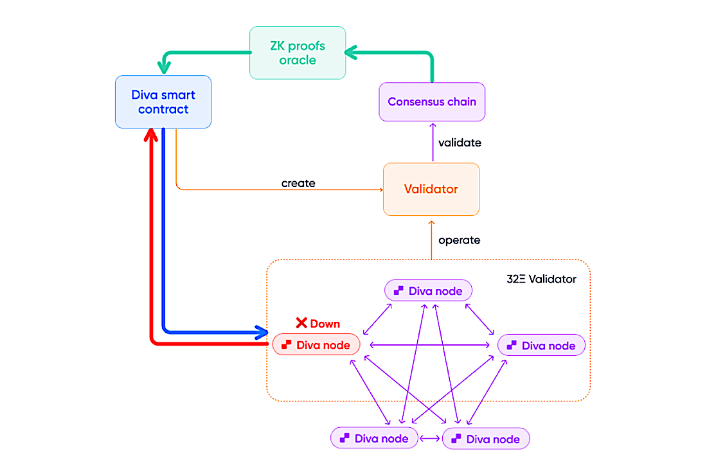

# Introduction

Diva is an Ethereum Liquid Staking protocol powered by Distributed Validator Technology (DVT). This page contains specifications of the Diva Staking protocol.

## Diva's Liquid Staking

**Distributed Validator Technology (DVT):**
Diva extends Ethereum's Proof of Stake with DVT, providing enhanced functionality for Stakers and Operators.

**Liquid Staking:**
Liquid Stakers receive divETH, a Liquid Staking Token that accrues Ethereum Staking Rewards, with no minimum ETH to stake and no lockups.

**Operators and Validation:**
Operators run a Distributed Validation node to fulfill staking duties, offering resilient operations with features like fully disposable nodes, the ability to regenerate lost keys, and approximately 500x better uptime thanks to DVT fallbacks.

**Trust-minimized Architecture:**
Diva ensures a trustless and permissionless architecture, utilizing "Can't be evil" cryptographic systems and providing collateral protection for Stakers.

**Incentives and Penalties:**
Smooth Staking Rewards and quick ejection of bad actors are part of Diva's incentive mechanism, aligning network participants according to their contributions.

## Distributed Validation & Architecture

The Diva Smart Contract deposits ETH from Liquid Stakers into the Ethereum Consensus Layer to form a new validator every time 32Ξ is reached. Key Shares, created using Distributed Key Generation (DKG) and "Boneh–Lynn–Shacham" BLS signatures, allow Operators to split validator keys across nodes.

Utilizing Multi-Party Computation (MPC), private keys remain separate, negating single failure points. This technology, used by firms like Fireblocks, ensures a uniform distribution of duties, vital to prevent attacks and clusterization.