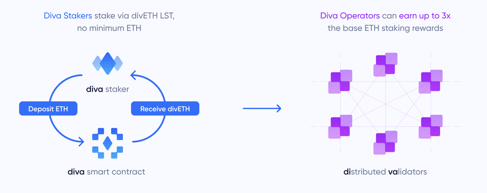

# Introduction

Diva is an Ethereum Liquid Staking protocol powered by Distributed Validator Technology (DVT). This page contains specifications of the Diva Staking protocol.

## Liquid Stakers (or "Stakers")

Liquid Stakers deposit ETH to obtain divETH which automatically accrues Ethereum staking rewards (if any). Anyone can become a Liquid Staker with no minimum ETH requirement. Stakers depositing ETH to the Diva Smart Contract will instantly receive a transferable receipt token called divETH representing their staked ETH + any staking rewards it generates.

Diva's staking is "liquid" because Stakers receive liquid divETH, meaning it is immediately transferable or tradable, as opposed to being locked. Wallets holding divETH will see their balances update daily to reflect accrued staking rewards (or penalties, if any). This is accomplished via a rebasing mechanism.

## Operators

Operators running Diva nodes can lock some divETH as collateral to secure Ethereum and generate additional divETH Operator Rewards. An Operator performing their validation duties correctly will receive divETH as Operator Rewards, in addition to divETH's own Staking Rewards.

To incentivize good behavior, an Operator misbehaving or missing their validation duties might suffer penalties on their locked divETH. Operators can only receive Key Shares once they provide enough divETH collateral to the Diva Smart Contracts.

Liquid Stakers receive Staking Rewards protected by Operator collateral. Operators receive the base Staking Rewards for their divETH collateral + Operator Rewards. The more divETH an Operator locks, the more Key Shares they may receive, increasing their ability to generate rewards.

## Distributed Validation & Architecture

What makes Diva unique is that all ETH deposits are staked and operated by non-custodial, trustless Operators.

This happens in several steps, as illustrated above:

1. Liquid Stakers deposit ETH to Diva's Smart Contract, receiving liquid divETH that accrues Staking Rewards.
2. In increments of 32 ETH, deposits are bridged to the Ethereum Consensus Layer to form Ethereum validators.
3. Each validator is controlled by 16 Diva Key Shares, acting together as a singular validator key.
4. Operators lock divETH collateral to run a Diva node, operating Key Shares and earning additional Operator Rewards.
5. Diva's method of distributing Key Shares creates 16x more Operators for Ethereum's attestations and block production, bolstering network decentralization and enabling participation from only 1 ETH!